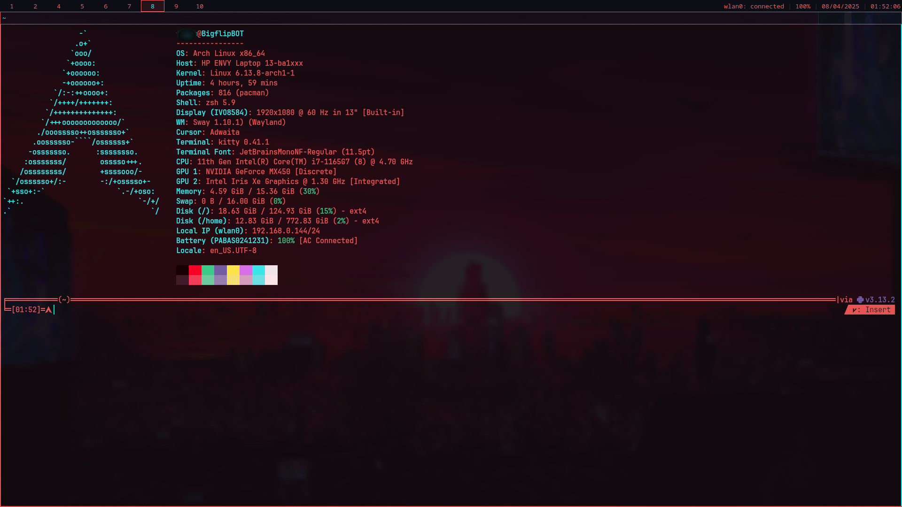
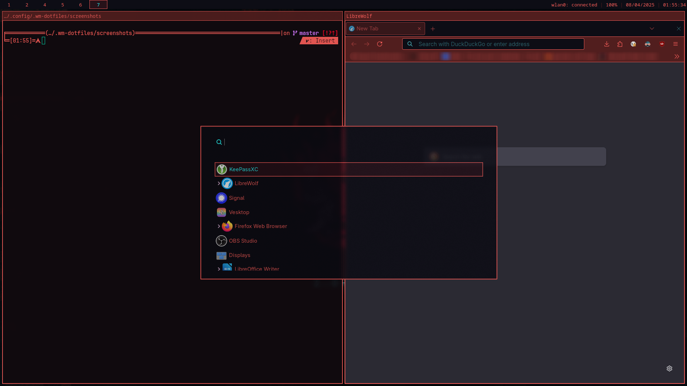
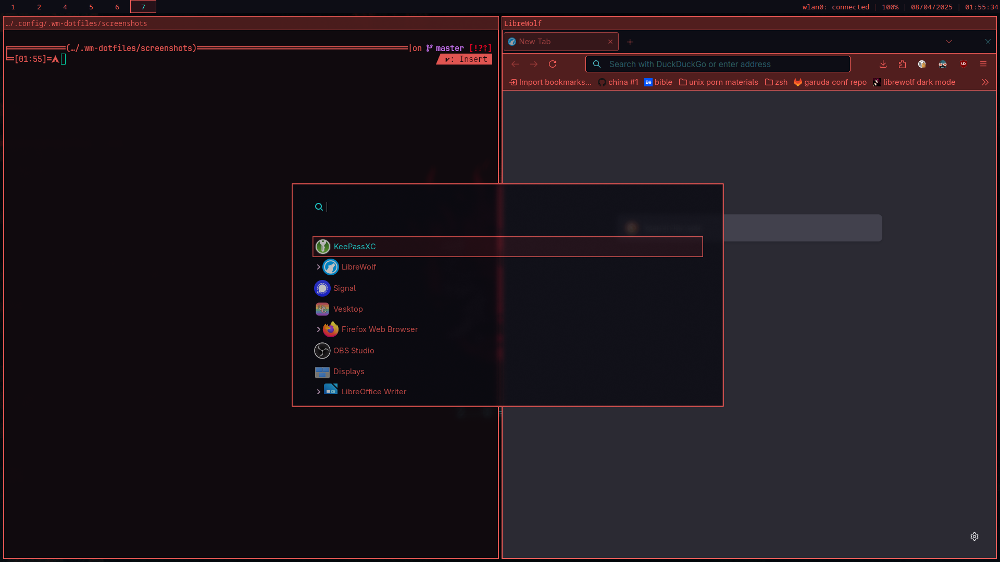

# Cyberpunk 2077 themed config for sway(fx)
This repo contains dotfiles for swayfx window manager. The general theming and color scheme is based on the UI of the Cyberpunk2077. Those are dotfiles that I am currently using, so you can consider this permanent work in progress.

<p align="center">
	
</p>

<details>
<summary>More Screenshots</summary>


</details>
<details>


## Contents
This repo focuses on visual aspects. In the main scope, there is sway and bar configuration, but there are also some other theming aspects for general apps. **It does not** contain (and will not) any shell configuration files (.bashrc, .zshrc, etc.) because in my opinion they should be tweaked to each users liking.

## Dependencies to install
##### hard dependencies:
```
swayfx polkit swaybg xorg-wayland wofi kitty grim slurp satty wl-clipboard jetbrainsmono-nerd
```
##### soft dependencies:
```
fastfetch vesktop starship
```
##### you may consider:
[firefox theme](https://addons.mozilla.org/en-US/firefox/addon/cyberpunk-2077-ui) (not mine)

## Installation
Contents of this repo are meant to be inside your .config dir contetns. All this is managed by stow (gnu symlink farm manager), so you can use it to install and manage it, or just pick and copy some files you need.

1. Make sure you installed dependencies
2. Install [stow](https://www.gnu.org/software/stow/)
3. Create folder inside your .config folder (.sway-dotfiles for example)
4. Clone this repo inside your new folder
5. Run command `stow .`
6. After this, reload (or enter) sway and you should be good to go

## Keybinds
List of some keybinds that you may find usefull when starting using this config.
Mod is a supper key.
| keys            			    | behavior							|
| -             		    	| -         			    		|
| mod + d         		    	| app launcher						|
| mod + return			    	| launch terminal					|
| mod + [hjkl]					| change focus [←↑↓→]				|
| mod + Shift + [hjkl]	        | move focused tab [←↑↓→]			|
| mod + [0-9]					| focus workspace [0-9]				|
| mod + shift + [0-9]			| move to  workspace [0-9]			|
| mod + shift + c				| reload sway						|
| mod + shift + s				| screenshot + screenshot menu      | 


If you want to learn more keybinds, visit `sway/config` file.

### Important notes:
##### swayfx and i3
This config was prepared for swayfx in mind, however all swayfx exclusive things are located in `sway/config.d/swayfx` so you can delete it to be compatible with regular sway. Also keeping in mind that sway is a drop in replacement for i3, there is a high chance that, with minimal effort it could be made compatbile with i3, however this was not tested.
##### background/wallpaper
There is no background present in this repo. To set it, create `wallpaper` directory, in your .config, paste your image there and modify `sway/config.d/background` accordingly.
##### discord/vesktop theme
There is a custom theme for discord application. To use it you have to download **vesktop** custom client and enable it in settings. Also after recent discord UI update, you have to reverse back to old one. At a time of writing this, it is possible by going into Experiments settings in Developers Only section, and setting Desktop Visual Refresh bucket override to 0, 5, or N/E.
